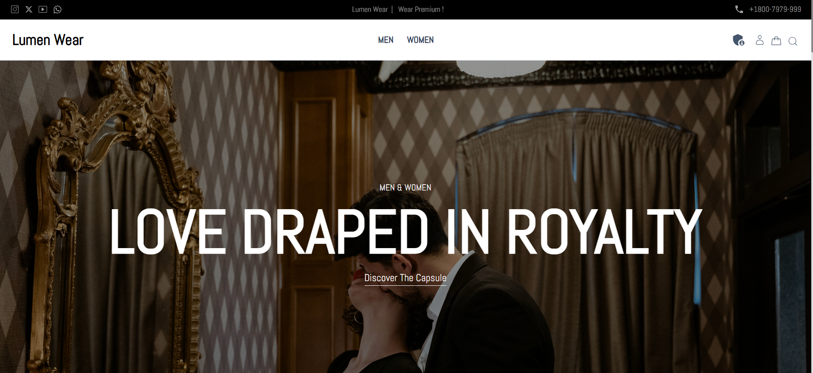
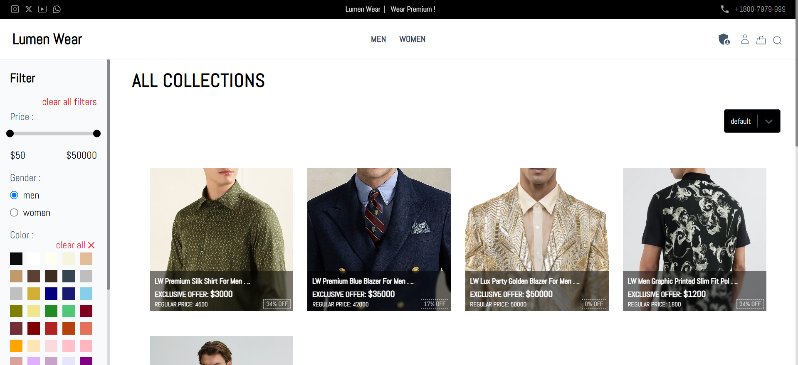
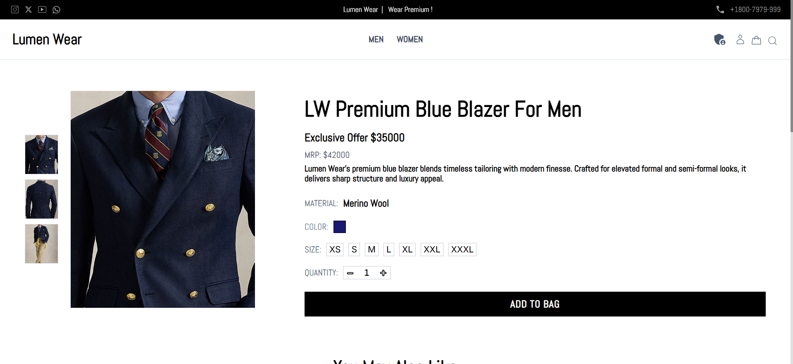
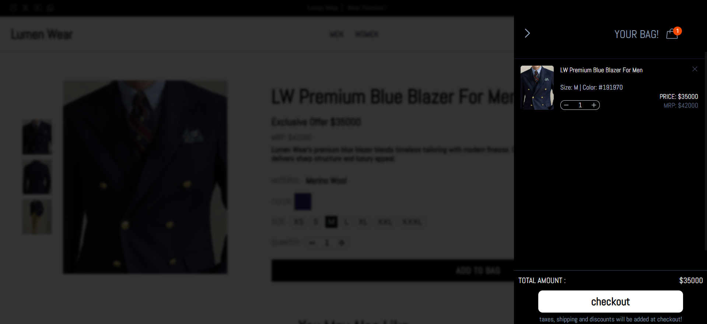
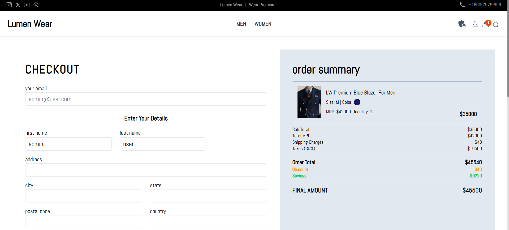
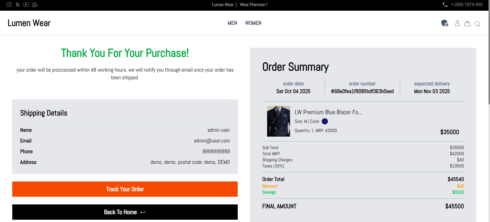

# 🌙 Lūmen Wear

**Lūmen Wear** is a premium e-commerce platform built using the **MERN stack (MongoDB, Express, React, Node.js)**. Designed for a minimalist luxury clothing brand, the app delivers a seamless, high-end shopping experience for modern fashion consumers.

---

## ✨ Features

- 🛍️ Elegant, responsive product catalog
- 🔐 Secure authentication system (JWT)
- 🛒 Cart & wishlist functionality
- 📦 Order placement & order history
- 🧑‍💼 Admin dashboard for product & order management
- 🔎 Dynamic search and category-based filtering
- 📷 Image upload support for products
- ⚡ Fast performance & mobile-optimized

---

## 🛠️ Tech Stack

| Layer        | Technology                    |
|--------------|-------------------------------|
| Frontend     | React, Tailwind CSS / SCSS    |
| State Mgmt   | Redux Toolkit / Context API   |
| Backend      | Node.js, Express.js           |
| Database     | MongoDB, Mongoose             |
| Auth         | JWT + bcrypt                  |
| File Upload  | Multer + Cloudinary / local   |
| Deployment   | Vercel  (frontend) / (backend) |


---

## 🌐 Live Demo

👉 [View Live Project](https://l-men-wear-jww4.vercel.app/)

> 💡 Explore the platform using the demo credentials below.

[▶️ Click here to watch the demo video](./assets/demo.mp4)

## 🖼️ Screenshots

### 🏠 Home Page  


---

### 🛒 Collections Page  


---

### 🛍️ Product Detail Page  


---

### 🛒 Cart Page  


---

### 🛒 Checkout Page  


---

### 🛒 Order Page  


---

### 🧑‍💼 Admin Panel  


> These screenshots highlight the core user flows and admin functionality in **Lūmen Wear**.


---

## 👤 Demo User Credentials

```bash
Email: admin@user.com
Password: 0000000

```md
> ⚠️ **Note:** Demo user has limited permissions. Delete actions are disabled to protect data integrity.

---
## 🛠️ Getting Started

Follow the steps below to set up and run the project locally:

```bash
# 1. Clone the repository
git clone https://github.com/the-coder-sachin/-L-men-Wear.git
cd L-men-Wear

# 2. Install dependencies
cd backend && npm install
cd ../frontend && npm install

# 3. Configure environment variables

# 👉 backend/.env
PORT=5000
MONGODB_URI=your_mongodb_connection_string
JWT_SECRET=your_jwt_secret
CLOUDINARY_CLOUD_NAME=your_cloud_name
CLOUDINARY_API_KEY=your_api_key
CLOUDINARY_API_SECRET=your_api_secret

# 👉 frontend/.env
VITE_BACKEND_URL=http://localhost:5000

# 4. Run in development mode
cd backend && npm run dev
cd ../frontend && npm run dev

# 5. Build frontend for production (Vite)
cd frontend
npm run build


